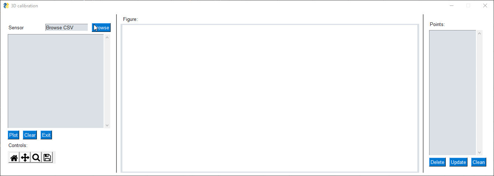

# Remove-Outliers-with-PYSimpleGUI-from-a-linear-regression

Using PYSimple GUI based in the widget from SuperMechaDeathChrist; plt_figure_w_controls.py https://github.com/SuperMechaDeathChrist/Widgets

I modified it in order i can load my own csv, plot them and remove the outliers only with one click

For the moment is deleting one by one, but soon i'll modify to select all what you want and then delete these

Example:

